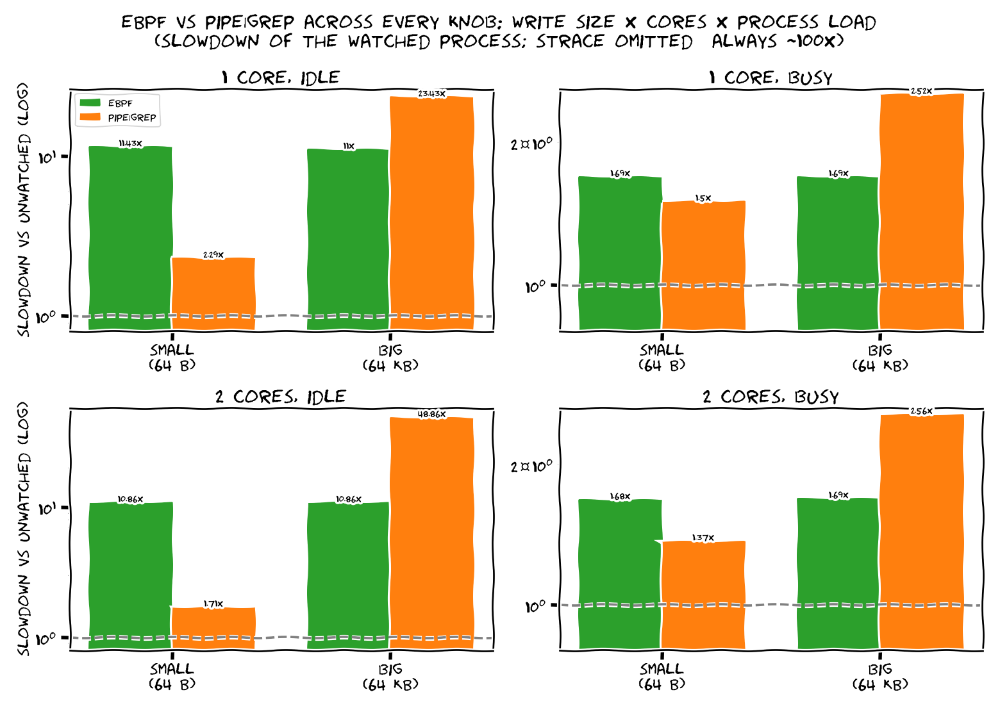

# ebpf-vs-userspace

[](https://github.com/aviNaftalis/ebpf-vs-userspace/actions/workflows/ci.yml)

Count a running process's `ERROR` log lines **without stopping it** — three ways:
**eBPF** (a kernel hook on `write()`), the classic **`pipe | grep`**, or **`strace`**
(`ptrace`). How much does each slow the process down? It depends on three knobs:
**write size, spare cores, and whether the process actually does work.**

**TL;DR**
- **`strace`: always ~100× — never in production.** It context-switches to a userspace
  tracer on *every* syscall.
- **eBPF vs `pipe | grep`: it depends** (see the matrix). `pipe | grep` wins *only* for
  small writes *with a spare core*; eBPF wins on big writes or one core.
- **On a process that does real work, every overhead is tiny (~1.1×).** The scary
  "2.5×" only happens when the process does nothing but write to `/dev/null`.

## Why `strace` is hopeless: the context switch


All three watch every `write()`; the difference is **how often each leaves the
kernel**. `strace` switches per syscall (~100×); `pipe | grep` *batches* (the pipe
buffers ~64 KB, so ~1 switch per few thousand writes); eBPF *never* switches.
(eBPF's ~600 ns is inline on the process's own thread; `pipe | grep`'s ~235 ns is
just the pipe-write — `grep` scans on another core.)

## The full picture: every knob

eBPF vs `pipe | grep` across **write size × cores × process load** (`strace` omitted —
always ~100×):



- **Small writes + a spare core →** `pipe | grep` wins: it batches its switches and
  offloads the scan to another core.
- **Big writes (≈ the pipe's 64 KB buffer) →** batching collapses (it fills every
  write) and it must move every byte → **eBPF wins**.
- **One core →** nothing to offload to → eBPF wins or ties.
- **Busy process (real work per line) →** every overhead shrinks toward ~1.1× — eBPF
  is essentially free; the headline ratios were an artifact of a do-nothing baseline.

## Where eBPF shines so bright nothing competes: XDP

The benchmark above is *observability*, where eBPF is good but not always the
fastest. eBPF's genuinely **unbeatable** use case is **XDP** — running the program
in the NIC driver, *before* the kernel allocates an `sk_buff`. For dropping or
redirecting packets (DDoS filtering, L4 load balancing) nothing in userspace is
close:

| dropping ~64 B packets, 1 core | drops/sec |
|---|--:|
| **XDP (eBPF, in the driver)** | **~26 M** |
| iptables / netfilter | ~2 M |
| userspace (recv + drop) | ~0.1–1 M |

*(Published numbers: [Red Hat — 26 Mpps/core](https://docs.redhat.com/en/documentation/red_hat_enterprise_linux/8/html/configuring_and_managing_networking/using-xdp-filter-for-high-performance-traffic-filtering-to-prevent-ddos-attacks_configuring-and-managing-networking); iptables ~2 Mpps. The win is that iptables/userspace only see a packet *after* the kernel has built an `sk_buff` and walked the stack — under attack, that bookkeeping alone melts the box.)*

**But it only shines with the knobs set right — turn them wrong and it's ordinary:**
- **Packet size** — XDP wins on *small* packets (DDoS = millions of tiny pps, where per-packet overhead is everything). With large packets you're bandwidth-bound by the NIC, so XDP's per-packet edge barely shows.
- **XDP mode** — *native* (driver) XDP is the fast path; *generic/SKB* mode runs after the `sk_buff` is allocated and gives up most of the advantage.
- **Cores / RX queues** — XDP scales per-queue; more cores → more pps.
- **The action** — dropping/redirecting *in-kernel* is the sweet spot. If you have to send the packet up to userspace anyway, the advantage collapses.

So: small packets + native mode + in-kernel drop → 10×+ anything else; large packets, or generic mode, or a userspace handoff → XDP looks unremarkable.

> Reproducing the 26 Mpps needs a real NIC and a line-rate traffic generator — a CI
> VM can't make that traffic, so this table is published-numbers, not measured here.
> (The measured charts above are the observability story, which CI *can* run.)

## When to use what
- **eBPF** — watch a process you can't change, a firehose you only want summarized, or
  when there's no spare core. Cheap and invisible; can't *parse* (the verifier bans loops/regex).
- **pipe | grep** — you own the app, output is small/streamed, and you have a spare core.
- **strace** — debugging only; brutal at scale.

<details><summary>exact numbers for the headline config (auto-refreshed by CI)</summary>

<!-- RESULTS:START -->
_Generated by CI on 2026-06-17, kernel `6.17.0-1018-azure`, 4 CPUs. Workload: 200000 lines, 10% ERROR, one `write()` each (expected ERROR count = 20000)._

| method | wall (ms) | throughput (K lines/s) | slowdown vs baseline | ERROR count correct? |
|---|--:|--:|--:|:--:|
| baseline (unobserved) | 80 | 2500 | 1.0× | – |
| **eBPF (in-kernel)** | 201 | 995 | 2.5× | yes |
| pipe \| grep (userspace) | 131 | 1527 | 1.6× | yes |
| strace / ptrace (userspace) | 13870 | 14 | 173.4× | yes |

**Per-`write()` overhead (the honest number):** the bare baseline write costs ~400 ns. eBPF adds **~605 ns** (prefix check) — or just **~545 ns** if it only counts (skipping the user-memory read). The big ×'s above are only because the baseline write (to `/dev/null`) is nearly free; on a process doing real work per syscall, ~605 ns is well under 1%.

<!-- RESULTS:END -->

</details>

## Run it

Linux with BTF (`/sys/kernel/btf/vmlinux`) + root:

```bash
make && sudo ./scripts/bench.sh && python3 scripts/plot.py
```

CI runs it on `ubuntu-latest` and commits the refreshed charts + numbers here on every
push. Code: [`error_count.bpf.c`](src/error_count.bpf.c) ·
[`ebpf_observer.cpp`](src/ebpf_observer.cpp) · [`logtarget.cpp`](src/logtarget.cpp) ·
[`bench.sh`](scripts/bench.sh) · [`plot.py`](scripts/plot.py).
