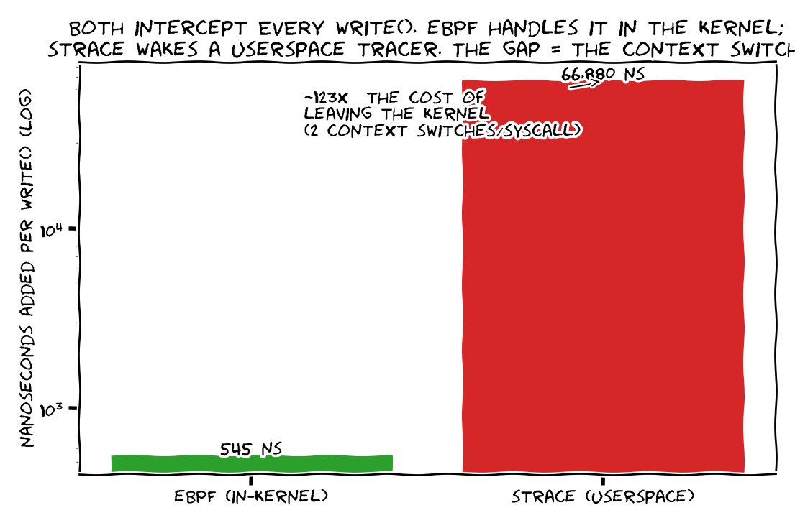
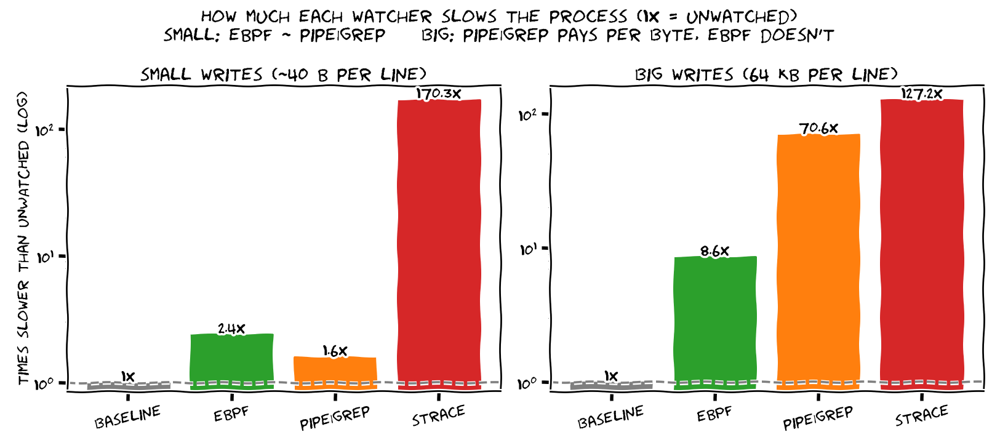
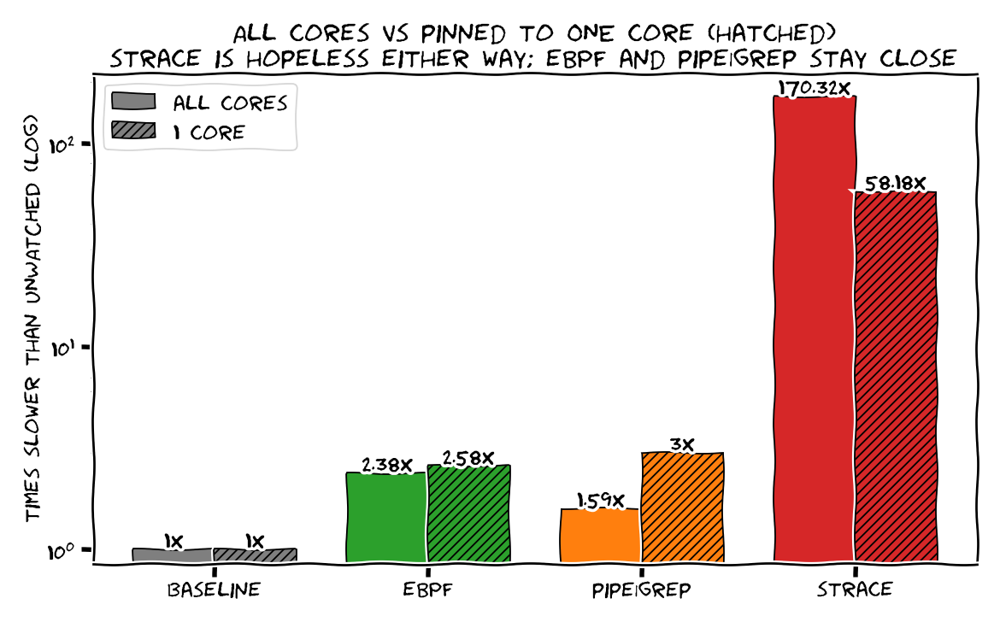
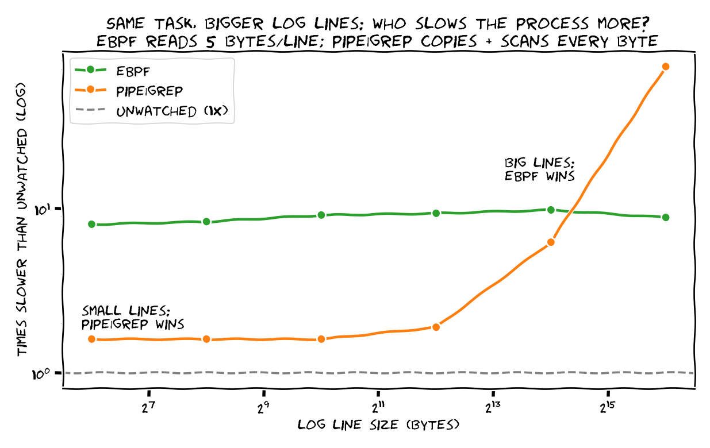

# ebpf-vs-userspace

Count a running process's `ERROR` log lines **without stopping it** — four ways,
measuring how much each one slows the process down vs unwatched (**baseline = 1×**).

**TL;DR**
- **eBPF beats `strace` ~100×** — no per-syscall context switch. (Robust.)
- **eBPF ≈ `pipe | grep`** (both ~2–3×) — `pipe | grep` only edges ahead when `grep`
  gets its own core; pin everything to one core and they land together.
- **Bigger log lines → eBPF wins** — it peeks 5 bytes; `grep` scans every byte.

The workload: 200,000 lines, one `write()` each. eBPF hooks `write()` in the kernel;
`pipe | grep` is the classic pipeline; `strace` uses `ptrace`. All return the right count.

**eBPF's whole point — it skips the context switch.** eBPF and `strace` both intercept
*every* `write()`, but `strace` has to wake a userspace tracer (2 context switches per
syscall) while eBPF handles it in the kernel. Per event, that's the difference:

That ~100× gap **is** the context switch. The charts below are the fuller picture —
how much each way slows the watched process (small vs big writes), on one core, and
across log-line sizes:

## A few results that look wrong (but aren't)

- **"eBPF slows my process ~2.5×?!"** Not really — that ratio is against a baseline
  that does almost nothing (a `write()` to `/dev/null`). The honest cost is the
  **ns eBPF adds per write** (in the table): a fixed few hundred ns, which is
  [<2–5% on a real workload](https://www.brendangregg.com/ebpf.html). Most of that
  cost is the per-event probe *machinery* (tracepoint dispatch + running the program),
  not the payload read — skipping the read ("count only") saves only ~10%. The point:
  any per-syscall eBPF carries a fixed sub-µs cost — huge next to a `/dev/null` write,
  negligible next to real work. (eBPF already runs **entirely in the kernel** per
  event — no per-event hop to userspace.)
- **`strace` is *faster* pinned to one core.** ptrace is a forced tracer↔tracee
  ping-pong — the tracee is frozen while strace runs, so a second core buys it
  nothing and only adds a cross-core wakeup per syscall. One core = cheap local
  switches.
- **eBPF ≈ `pipe | grep` even on one core**, even though only eBPF avoids userspace.
  The pipe *buffers* (~64 KB), so `grep` causes a context switch every few thousand
  writes, not per write — batched and cheap. eBPF does a little work on *every*
  write instead. The per-*syscall* switch is what makes `strace` 100×; the pipe
  dodges it by batching.

## When to use what
- **eBPF** — watch a process you can't change, or firehose data you only want a
  summary of. Cheap and invisible; can't *parse* (the verifier bans loops/regex).
- **pipe | grep** — you own the app and have a spare core.
- **strace** — debugging only; brutal at scale.

exact numbers (auto-refreshed by CI)

<!-- RESULTS:START -->
_Generated by CI on 2026-06-17, kernel `6.17.0-1018-azure`, 4 CPUs. Workload: 200000 lines, 10% ERROR, one `write()` each (expected ERROR count = 20000)._

| method | wall (ms) | throughput (K lines/s) | slowdown vs baseline | ERROR count correct? |
|---|--:|--:|--:|:--:|
| baseline (unobserved) | 79 | 2532 | 1.0× | – |
| **eBPF (in-kernel)** | 188 | 1064 | 2.4× | yes |
| pipe \| grep (userspace) | 126 | 1587 | 1.6× | yes |
| strace / ptrace (userspace) | 13455 | 15 | 170.3× | yes |

**Per-`write()` overhead (the honest number):** the bare baseline write costs ~395 ns. eBPF adds **~545 ns** (prefix check) — or just **~480 ns** if it only counts (skipping the user-memory read). The big ×'s above are only because the baseline write (to `/dev/null`) is nearly free; on a process doing real work per syscall, ~545 ns is well under 1%.

<!-- RESULTS:END -->

## Run it

Linux with BTF + root: `make && sudo ./scripts/bench.sh && python3 scripts/plot.py`.
CI does this on `ubuntu-latest` and commits the refreshed charts here on every push.
Code: [`error_count.bpf.c`](src/error_count.bpf.c) ·
[`ebpf_observer.cpp`](src/ebpf_observer.cpp) · [`logtarget.cpp`](src/logtarget.cpp) ·
[`bench.sh`](scripts/bench.sh) · [`plot.py`](scripts/plot.py).
