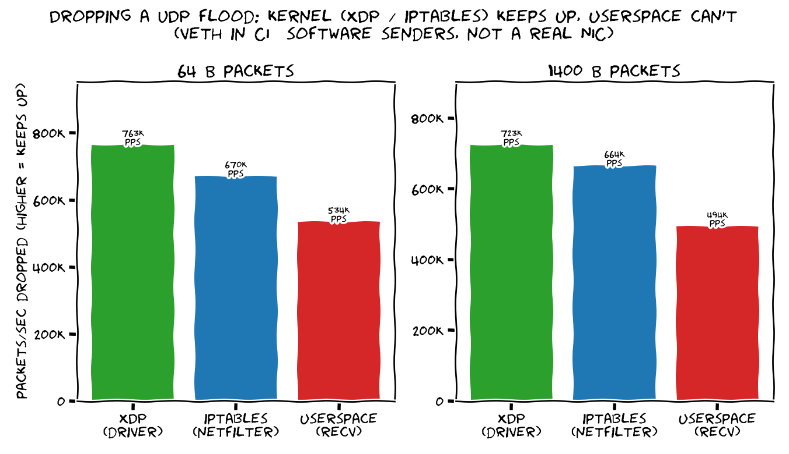

# ebpf-vs-userspace

[](https://github.com/aviNaftalis/ebpf-vs-userspace/actions/workflows/ci.yml)

**Where eBPF beats everything: dropping packets before the kernel even builds an
`sk_buff`.** This is XDP — an eBPF program that runs *in the NIC driver*, the first
code to touch a packet. The classic use case is DDoS filtering: drop millions of
junk packets per second per core, at almost no cost.

We drop the same UDP flood three ways and count how many packets/sec each keeps up with:

| | where it runs | what it pays per packet |
|---|---|---|
| **XDP** (eBPF) | in the driver, before `sk_buff` | almost nothing — drop and return |
| **iptables** | netfilter, after `sk_buff` + IP stack | alloc + stack walk, then drop |
| **userspace** | a `recvmmsg()` loop on a socket | all of the above + socket queue + copy to userspace |

**TL;DR — it's all about *how early you can say no.*** XDP says no in the driver;
iptables says no after the kernel has already done the expensive bookkeeping;
userspace says no last, after paying for everything. Under a flood, that ordering
is the whole story.

## The measurement



The kernel-side droppers (XDP, iptables) keep up with whatever the senders offer;
**userspace falls behind** — every packet it sees costs an sk_buff, a trip up the IP
stack, a socket-queue enqueue, and a copy into the process. The packets it can't
get to in time the kernel silently drops, so its bar is what one core can *actually*
pull out of a socket.

<!-- RESULTS:START -->
_Measured by CI on 2026-06-17 — kernel `6.17.0-1018-azure`, 4 CPUs, over a veth pair (software, not a real NIC; see the caveat above)._

| payload | XDP (driver) | iptables (netfilter) | userspace (recv) |
|---|--:|--:|--:|
| 64 B | 763 K pps | 670 K pps | 534 K pps |
| 1400 B | 723 K pps | 664 K pps | 494 K pps |

Packets/sec each method drained from the same flood. XDP and iptables drop in the kernel and keep up with whatever the (software) senders offer; **userspace can't** — the gap is everything it pays per packet that the kernel paths skip.

<!-- RESULTS:END -->

## The honest caveat (why these aren't the famous numbers)

The headline XDP figure everyone quotes is **~26 Mpps per core** ([Red Hat](https://docs.redhat.com/en/documentation/red_hat_enterprise_linux/8/html/configuring_and_managing_networking/using-xdp-filter-for-high-performance-traffic-filtering-to-prevent-ddos-attacks_configuring-and-managing-networking)),
vs **~2 Mpps** for iptables — a 10×+ gap. **You won't see that gap here**, because:

- Reproducing it needs a **real NIC + a line-rate traffic generator**. A GitHub
  Actions VM has neither — it floods a `veth` pair in software, so the *sender* is
  the bottleneck, not the dropper.
- At those modest rates XDP and iptables both keep up, so they look tied. The thing
  CI *can* show honestly is the next rung down: **kernel-drop ≫ userspace-drop**,
  and how the gap moves with packet size.

So treat the chart as "the ordering is real, on hardware the top two pull apart."

## Turn the knobs wrong and XDP is ordinary

XDP only shines when the conditions are right — the same physics that make it
unbeatable for DDoS make it pointless elsewhere:

- **Packet size** — XDP wins on *small* packets, where per-packet overhead dominates
  (DDoS = millions of tiny packets). With large packets you're bandwidth-bound by the
  wire, so the per-packet edge barely shows. *(That's the two panels above.)*
- **Native vs generic mode** — *native* XDP runs in the driver; *generic/SKB* mode
  runs after the `sk_buff` is allocated and throws away most of the advantage.
- **The action** — dropping/redirecting *in-kernel* is the sweet spot. If you have to
  hand the packet up to userspace anyway, you've paid the full price — XDP bought you
  nothing.

## How it works

`veth` pair with one end in its own netns, so traffic crosses a virtual wire. A pack
of senders floods it; whichever method is active is the only thing draining it.

- [`xdp_count.bpf.c`](src/xdp_count.bpf.c) — the XDP program: parse eth→IP, drop UDP
  (everything else passes, so ARP still resolves), count in a `.bss` variable.
- [`xdp_loader.cpp`](src/xdp_loader.cpp) — attach it (native, falls back to generic),
  measure the drop rate, detach.
- [`udp_flood.cpp`](src/udp_flood.cpp) · [`udp_sink.cpp`](src/udp_sink.cpp) — the
  sender and the userspace receiver.
- [`bench.sh`](scripts/bench.sh) · [`plot.py`](scripts/plot.py) — orchestrate + chart.

## Run it

Linux with BTF (`/sys/kernel/btf/vmlinux`) + root:

```bash
make && sudo ./scripts/bench.sh && python3 scripts/plot.py packets.csv
```

CI runs it on `ubuntu-latest` and commits the refreshed chart + numbers on every push.
